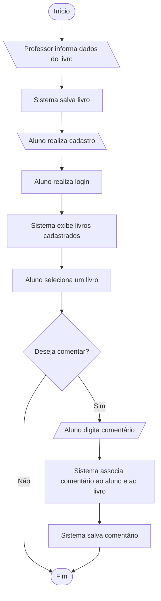

    

```mermaid
flowchart TD

    A([Início])
    A --> B[\Professor informa dados do livro\]
    B --> C[Sistema salva livro]
    C --> D[\Aluno realiza cadastro\]
    D --> E[Aluno realiza login]
    E --> F[Sistema exibe livros cadastrados]
    F --> G[Aluno seleciona um livro]
    G --> H{Deseja comentar?}
    H -->|Sim| I[/Aluno digita comentário/]
    I --> J[Sistema associa comentário ao aluno e ao livro]
    J --> K[Sistema salva comentário]
    H -->|Não| L([Fim])
    K --> L

```